# Images 

## Prune

```terminal
$ docker image prune

or

$ docker image prune -a

or

$ docker image prune -a -f
```



## Remove

```terminal
$ docker image rm <image name>

or

$ docker image rm <image id>
```


## Tagging

```terminal
$ docker image tag <source image name:tag> <target image name:tag>
```


## Inspect

Inspect Details of Image

```
$ docker image inspect <image name> 

or 

$ docker image inspect <image id>
```


## List 

List all Images


```
$ docker images
```

```
$ docker images --all 

or 

$ docker images -a
```

```
$ docker images --quiet

or

$ docker images -q
```


## Layers

### Display

### Modify Image to Single Layer


## History

```
$ docker image history <image name>

or 

$ docker image history <image id>
```

